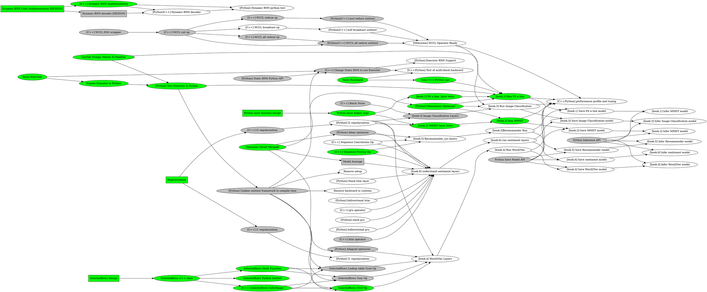

Just copy the source file to graph.dot, and use the following command to compile it.

```bash
dot -Tpng graph.dot > graph.png
```


```dot
digraph G {
   rankdir=LR
   optimizer [label="Optimizer [Draft Merged]", style=filled, fillcolor=green]
   momentum [label="[Python] Momentum Optimizer", style=filled, fillcolor=green]
   adam [label="[Python] Adam optimizer", style=filled, fillcolor=gray]
   adagrad [label="[Python] Adagrad optimizer", style=filled, fillcolor=gray]

   optimizer -> momentum
   optimizer -> adam
   optimizer -> adagrad

   model_average [label="Model Average",  label="Model Average", shape=box, style=filled, fillcolor=gray]
   optimizer -> model_average

   regular [label="Regularization", shape=box, style=filled, fillcolor=green]

   l1_op [label="[C++] l1 regularization", style=filled, fillcolor=gray]
   l2_op [label="[C++] l2 regularization", style=filled, fillcolor=gray]

   l1 [label="[Python] l1 regularization"]
   l2 [label="[Python] l2 regularization"]

   regular -> l1_op -> l1
   regular -> l2_op -> l2

   nccl_dso [label="[C++] NCCL DSO wrapper", style=filled, fillcolor=gray]

   nccl_init_op [label="[C++] NCCL init op", style=filled, fillcolor=gray]
   nccl_dso -> nccl_init_op

   nccl_allreduce_op [label="[C++] NCCL all reduce op", style=filled, fillcolor=gray]
   nccl_init_op -> nccl_allreduce_op
   nccl_allreduce_unittest [label="[Python/C++] NCCL all reduce unittest", style=filled, fillcolor=gray]
   nccl_init_op -> nccl_allreduce_unittest
   nccl_allreduce_op -> nccl_allreduce_unittest

   nccl_reduce_op [label="[C++] NCCL reduce op", style=filled, fillcolor=gray]
   nccl_reduce_unittest [label="[Python/C++] nccl reduce unittest", style=filled, fillcolor=gray]
   nccl_init_op -> nccl_reduce_op
   nccl_reduce_op -> nccl_reduce_unittest

   nccl_broadcast_op [label="[C++] NCCL broadcast op"]
   nccl_broadcast_unittest [label="[Python/C++] null broadcast unittest"]
   nccl_init_op -> nccl_broadcast_op
   nccl_broadcast_op -> nccl_broadcast_unittest

   nccl_ops_ready [label="[Milestone] NCCL Operator Ready"]

   nccl_allreduce_unittest -> nccl_ops_ready
   nccl_reduce_unittest -> nccl_ops_ready
   nccl_broadcast_unittest -> nccl_ops_ready


   selected_rows_design [label="SelectedRows Design", shape=box, style=filled, fillcolor=green]
   selected_rows_cpp_class [label="SelectedRows C++ class", style=filled, fillcolor=green]
   selected_rows_math_functions [label="SelectedRows Math Function", style=filled, fillcolor=green]
   selected_rows_python_wrapper [label="SelectedRows Python Get/Set", style=filled, fillcolor=green]
   selected_rows_infer_shape [label="[C++] SelectedRows InferShape", style=filled, fillcolor=green]

   selected_rows_sum_op [label="SelectedRows Sum Op", style=filled, fillcolor=gray]
   selected_rows_sgd [label="SelectedRows SGD Op", style=filled, fillcolor=green]
   selected_rows_lookup_grad_op [label="SelectedRows Lookup table Grad Op", style=filled, fillcolor=gray]

   selected_rows_design -> selected_rows_cpp_class
   selected_rows_cpp_class -> selected_rows_math_functions
   selected_rows_cpp_class -> selected_rows_python_wrapper
   selected_rows_cpp_class -> selected_rows_infer_shape

   selected_rows_infer_shape -> selected_rows_sum_op
   selected_rows_math_functions -> selected_rows_sum_op

   selected_rows_infer_shape -> selected_rows_sgd
   selected_rows_math_functions -> selected_rows_sgd

   selected_rows_infer_shape -> selected_rows_lookup_grad_op
   selected_rows_math_functions -> selected_rows_lookup_grad_op

   rnn_api [label="[Python] Static RNN Python API", style=filled, fillcolor=gray]
   rnn_api -> change_rnn_by_executor
   change_rnn_by_executor [label="[C++] Change Static RNN to use Executor", style=filled, fillcolor=gray]
   executor_test [label="[Python] Test Executor in Python", style=filled, fillcolor=green]
   update_unittest_framework_by_compile_time [label="[Python] Update unittest framework to compile time", style=filled, fillcolor=gray]
   update_unittest_framework_by_compile_time -> change_rnn_by_executor
   update_unittest_framework_by_compile_time -> selected_rows_lookup_grad_op
   update_unittest_framework_by_compile_time -> selected_rows_sgd
   update_unittest_framework_by_compile_time -> selected_rows_sum_op

   remove_deprecated_backward [label="Remove backward in runtime"]
   remove_netop [label="Remove netop"]

   update_unittest_framework_by_compile_time -> remove_deprecated_backward
   update_unittest_framework_by_compile_time -> remove_netop


   executor_test -> update_unittest_framework_by_compile_time
   executor_rnn [label="[Python] Executor RNN Support"]
   basic_executor [label="Basic Executor", style=filled, fillcolor=green]
   python_executor [label="Expose Executor in Python", style=filled, fillcolor=green]

   change_rnn_by_executor -> executor_rnn

   basic_executor -> python_executor
   basic_executor -> change_rnn_by_executor
   python_executor -> executor_test

   dynamic_rnn_design [label="Dynamic RNN Code Implementation [DESIGN]", shape=box, style=filled, fillcolor=green]
   dynamic_rnn_implementation [label="[C++] Dynamic RNN implementation", style=filled, fillcolor=green]

   dynamic_rnn_python_test [label="[Python] Dynamic RNN python test"]
   dynamic_rnn_decoder_design [label="Dynamic RNN decoder [DESIGN]", shape=box, style=filled, fillcolor=gray]
   dynamic_rnn_decoder_impl [label="[Python/C++] Dynamic RNN decoder"]

   dynamic_rnn_design -> dynamic_rnn_implementation
   dynamic_rnn_implementation -> dynamic_rnn_python_test
   dynamic_rnn_design -> dynamic_rnn_decoder_design
   dynamic_rnn_decoder_design -> dynamic_rnn_decoder_impl
   dynamic_rnn_implementation ->  dynamic_rnn_decoder_impl
   dynamic_rnn_decoder_impl -> dynamic_rnn_python_test

   batch_norm [label="[C++] Batch Norm", style=filled, fillcolor=gray]

   backward [ label="Basic Backward", style=filled, fillcolor=green]
   backward_sync [ label="Sync C++/Python ops", style=filled, fillcolor=green]

   multi_block_backward_test [label="[C++/Python] Test of multi-block backward"]
   change_rnn_by_executor -> multi_block_backward_test
   backward -> multi_block_backward_test
   backward -> backward_sync

   python_layer_design [ label="Python layer function design", shape=box, style=filled, fillcolor=green]
   python_layer_helper_impl [ label="Python layer helper impl", style=filled, fillcolor=green]
   python_layer_design -> python_layer_helper_impl


   set_data_in_python [label="Get/Set Numpy Matrix To FeedVar", style=filled, fillcolor=green]

   set_data_in_python -> executor_test

   python_inferernce_famework [label="Python Inference API", style=filled, fillcolor=gray]
   python_save_model_api [label="Python Save Model API", style=filled, fillcolor=gray]

   book_chapter_1_layer_test [label="[book.1] Fit a line, layer tests", style=filled, fillcolor=green]
   book_chapter_1_layer_run [label="[book.1] Run Fit a line", style=filled, fillcolor=green]
   book_chapter_1_save_model [label="[book.1] Save Fit a line model"]
   book_chapter_1_infer [label="[book.1] Infer MNIST model"]

   python_save_model_api -> book_chapter_1_save_model
   python_inferernce_famework -> book_chapter_1_infer
   book_chapter_1_save_model -> book_chapter_1_infer
   book_chapter_1_layer_run -> book_chapter_1_save_model


   python_layer_helper_impl -> book_chapter_1_layer_test

   book_chapter_1_layer_test -> book_chapter_1_layer_run
   set_data_in_python -> book_chapter_1_layer_run
   backward_sync -> book_chapter_1_layer_run
   executor_test -> book_chapter_1_layer_run
   momentum -> book_chapter_1_layer_run

   book_chapter_2_layer_test [label="[book.2] MNIST layer tests", style=filled, fillcolor=green]
   book_chapter_2_layer_run [label="[book.2] Run MNIST", style=filled, fillcolor=green]
   book_chapter_2_save_model [label="[book.2] Save MNIST model"]
   book_chapter_2_infer [label="[book.2] Infer MNIST model"]

   python_save_model_api -> book_chapter_2_save_model
   python_inferernce_famework -> book_chapter_2_infer
   book_chapter_2_save_model -> book_chapter_2_infer
   book_chapter_2_layer_run -> book_chapter_2_save_model

   python_layer_helper_impl -> book_chapter_2_layer_test
   l2 -> book_chapter_2_layer_test
   book_chapter_2_layer_test -> book_chapter_2_layer_run
   momentum -> book_chapter_2_layer_run

   book_chapter_3_layer_test [label="[book.3] Image Classification Layers", style=filled, fillcolor=gray]
   book_chapter_3_layer_run [label="[book.3] Run Image Classification"]
   book_chapter_3_save_model [label="[book.3] Save Image Classification model"]
   book_chapter_3_infer [label="[book.3] Infer Image Classification model"]

   python_save_model_api -> book_chapter_3_save_model
   python_inferernce_famework -> book_chapter_3_infer
   book_chapter_3_save_model -> book_chapter_3_infer
   book_chapter_3_layer_run -> book_chapter_3_save_model


   batch_norm -> book_chapter_3_layer_test
   l2 -> book_chapter_3_layer_test
   momentum -> book_chapter_3_layer_run
   book_chapter_3_layer_test -> book_chapter_3_layer_run

   book_chapter_4_layer_test [label="[book.4] Word2Vec Layers"]
   book_chapter_4_layer_run [label="[book.4] Run Word2Vec"]
   book_chapter_4_save_model [label="[book.4] Save Word2Vec model"]
   book_chapter_4_infer [label="[book.4] Infer Word2Vec model"]

   python_save_model_api -> book_chapter_4_save_model
   python_inferernce_famework -> book_chapter_4_infer
   book_chapter_4_save_model -> book_chapter_4_infer
   book_chapter_4_layer_run -> book_chapter_4_save_model


   selected_rows_lookup_grad_op -> book_chapter_4_layer_test
   selected_rows_sum_op -> book_chapter_4_layer_test
   selected_rows_sgd -> book_chapter_4_layer_test
   adagrad -> book_chapter_4_layer_test
   l2 -> book_chapter_4_layer_test

   book_chapter_4_layer_test -> book_chapter_4_layer_run

   book_chapter_5_layer_test [label="[book.5] Recommender_sys layers"]
   book_chapter_5_layer_run [label="[book.5]Recommender Run"]
   book_chapter_5_save_model [label="[book.5] Save Recommender model"]
   book_chapter_5_infer [label="[book.5] Infer Recommender model"]

   python_save_model_api -> book_chapter_5_save_model
   python_inferernce_famework -> book_chapter_5_infer
   book_chapter_5_save_model -> book_chapter_5_infer
   book_chapter_5_layer_run -> book_chapter_5_save_model

   adam -> book_chapter_5_layer_test
   sequence_conv [label="[C++] Sequence Convolution Op"]
   sequence_pooling [label="[C++] Sequence Pooling Op", style=filled, fillcolor=green]
   sequence_conv -> book_chapter_5_layer_test
   sequence_pooling -> book_chapter_5_layer_test
   book_chapter_5_layer_test -> book_chapter_5_layer_run

   book_chapter_6_layer_test [label="[book.6] understand sentiment layers"]
   book_chapter_6_layer_run [label="[book.6] run sentiment layers"]
   book_chapter_6_save_model [label="[book.6] Save sentiment model"]
   book_chapter_6_infer [label="[book.6] Infer sentiment model"]

   python_save_model_api -> book_chapter_6_save_model
   python_inferernce_famework -> book_chapter_6_infer
   book_chapter_6_save_model -> book_chapter_6_infer
   book_chapter_6_layer_run -> book_chapter_6_save_model


   lstm_op [label="[C++] lstm operator", style=filled, fillcolor=gray]
   stack_lstm [label="[Python] Stack lstm layer"]
   bi_lstm [label="[Python] bidirectional lstm"]

   gru_op [label="[C++] gru operator"]
   stack_gru [label="[Python] stack gru"]
   bi_gru [label="[Python] bidirectional gru"]

   lstm_op -> book_chapter_6_layer_test
   stack_lstm -> book_chapter_6_layer_test
   bi_lstm -> book_chapter_6_layer_test
   gru_op -> book_chapter_6_layer_test
   stack_gru -> book_chapter_6_layer_test
   bi_gru -> book_chapter_6_layer_test
   adam -> book_chapter_6_layer_test
   l2 -> book_chapter_6_layer_test
   model_average -> book_chapter_6_layer_test
   sequence_pooling -> book_chapter_6_layer_test
   sequence_conv -> book_chapter_6_layer_test
   book_chapter_6_layer_test -> book_chapter_6_layer_run


   performance_profile [label="[C++/Python] performance profile and tuning"]
   book_chapter_1_layer_run -> performance_profile
   book_chapter_2_layer_run -> performance_profile
   book_chapter_3_layer_run -> performance_profile
   book_chapter_4_layer_run -> performance_profile
   book_chapter_5_layer_run -> performance_profile
   book_chapter_6_layer_run -> performance_profile

   nccl_ops_ready -> book_chapter_3_layer_run
   nccl_ops_ready -> performance_profile

   {
      book_chapter_1_layer_run
      book_chapter_2_layer_run
      book_chapter_3_layer_run
      book_chapter_4_layer_run
      book_chapter_5_layer_run
      book_chapter_6_layer_run
      rank=same;
   }

   {
     book_chapter_1_layer_test
     book_chapter_2_layer_test
     book_chapter_3_layer_test
     book_chapter_4_layer_test
     book_chapter_5_layer_test
     book_chapter_6_layer_test
     rank=same;
   }
   {
     book_chapter_1_infer
     book_chapter_2_infer
     book_chapter_3_infer
     book_chapter_4_infer
     book_chapter_5_infer
     book_chapter_6_infer
     rank=same;
   }
}
```